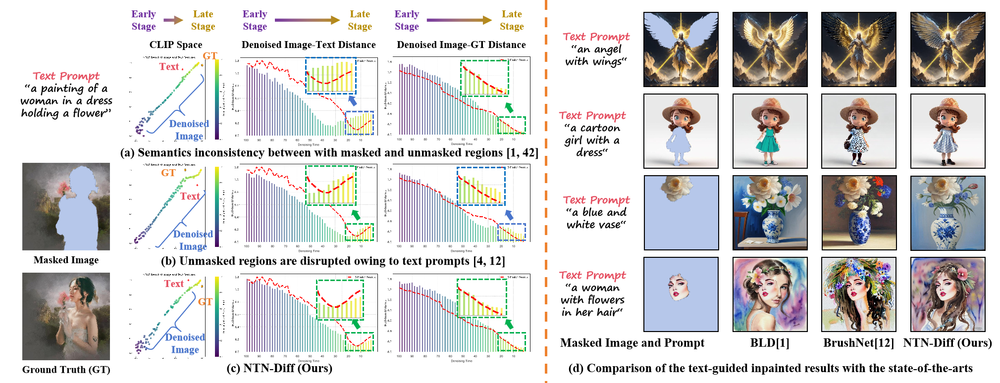
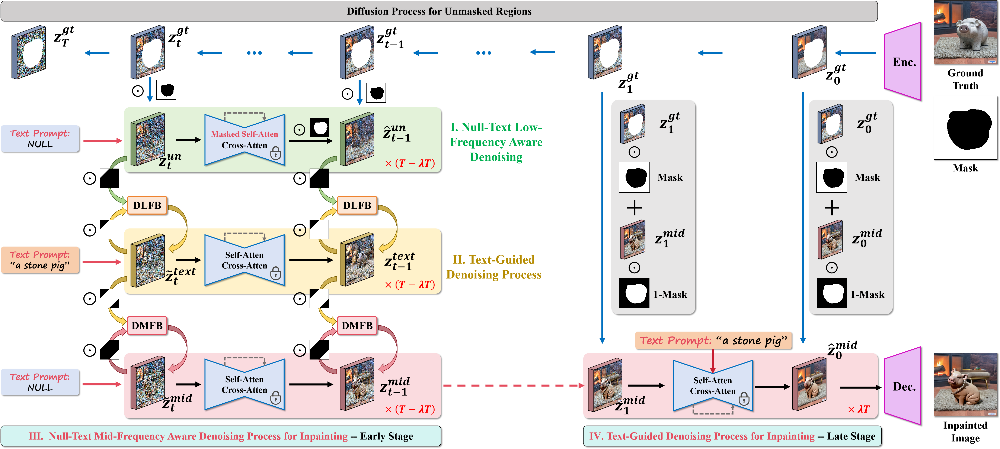
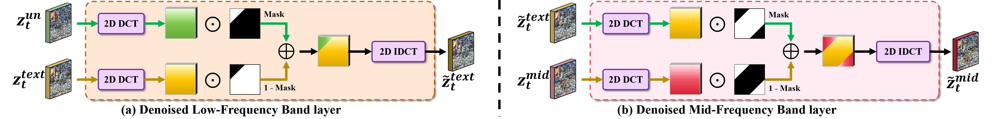
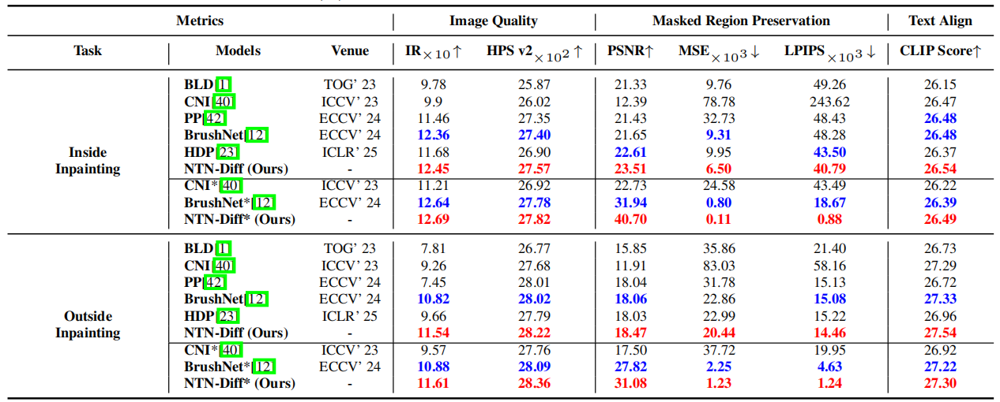
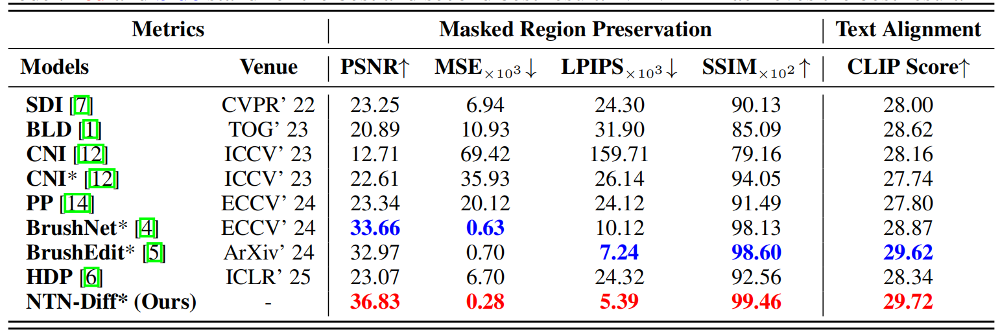
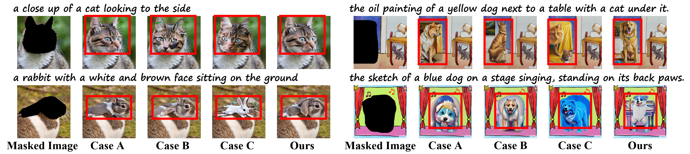
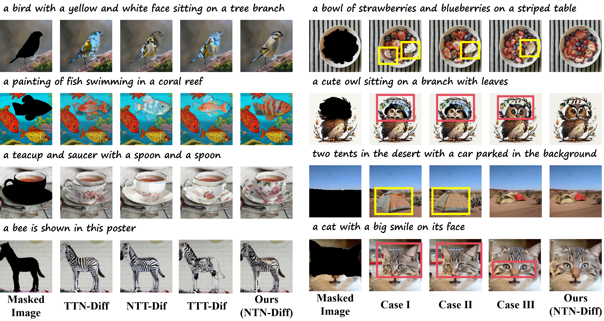

# NTN-Diff

This repository is the official code for the paper "One Stone with Two Birds: A Null-Text-Null Frequency-Aware Diffusion Models for Text-Guided Image Inpainting" by Haipeng Liu (hpliu_hfut@hotmail.com), Yang Wang* (corresponding author: yangwang@hfut.edu.cn), Meng Wang. NeurIPS 2025, San Diego, USA

#
## Motivation

Text-guided image inpainting aims at reconstructing the masked regions as per text prompts, where the longstanding challenges lie in the preservation for unmasked regions, while achieving the semantics consistency between unmasked and inpainted masked regions. Previous arts failed to address both of them, always with either of them to be remedied. Such facts, as we observed, stem from the entanglement of the hybrid (e.g., mid-and-low) frequency bands that encode varied image properties, which exhibit different robustness to text prompts during the denoising process.

- t-SNE visualization of CLIP latent space evolution during text-guided denoising.


- Illustration of the motivation NTN-Diff.


#
## Introduction

In this paper, we propose a null-text-null frequency-aware diffusion models, dubbed **NTN-Diff**, for text-guided image inpainting, by decomposing the semantics consistency across masked and unmasked regions into the consistencies as per each frequency band, while preserving the unmasked regions, to circumvent two challenges in a row. Based on the diffusion process, we further divide the denoising process into early (high-level noise) and late (low-level noise) stages, where the mid-and-low frequency bands are disentangled during the denoising process. As observed that, the stable mid-frequency band is progressively denoised to be semantically aligned during text-guided denoising process, which, meanwhile, serves as the guidance to the null-text denoising process to denoise low-frequency band for the masked regions, followed by a subsequent text-guided denoising process at late stage, to achieve the semantics consistency for mid-and-low frequency bands across masked and unmasked regions, while preserve the unmasked regions. Extensive experiments validate the superiority of NTN-Diff over the state-of-the-art diffusion models to text-guided diffusion models. 

- Illustration of the proposed NTN-Diff pipeline


- Illustration of (a) denoised low-frequency band layer and (b) mid-frequency band layer


#
## Inference
1. Dataset Preparation:
[BrushBench](https://github.com/TencentARC/BrushNet)
   
2. Pre-trained models:
[Realistic Vision V6.0 B1](https://civitai.com/models/4201?modelVersionId=501240)
  
3. Run the following command:
```
Python3 test.py
```

4. Inpainted Image: 
[Baidu](https://pan.baidu.com/s/1VG7yR5JD_gbA29rWHzxh9A?pwd=yyve)


#
## Example Results

- Visual comparison between our method and the competitors.


- Quantitative results.



- Ablation Studies



#
## Citation

If any part of our paper and repository is helpful to your work, please generously cite with:

```

```
